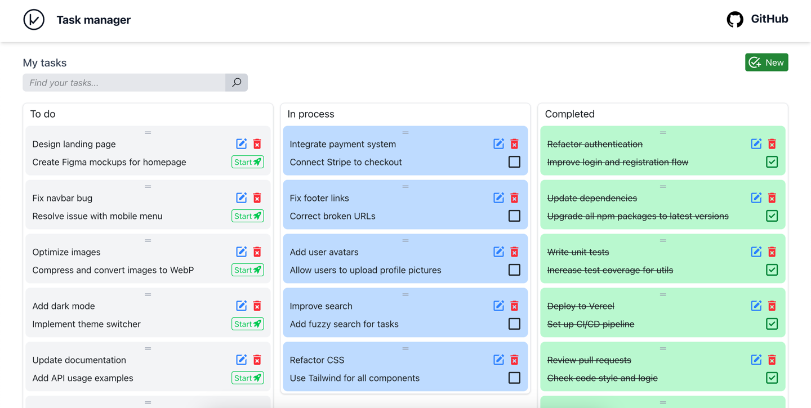

# 📝 Task Manager

A modern Task Manager with drag & drop, search, filtering, responsive design, and true task reordering within columns.

---

## 🚀 Demo

[Live Demo](https://rzotr2.github.io/task-manager/)

---

## 📸 Screenshots



---

## ⚡️ Features

- **Drag & Drop** between columns and within columns (true reorder, Trello-style)
- **Task sorting** in each column
- **Search and filtering** by title and description
- **Responsive design** (desktop, tablet, mobile)
- **CRUD tasks** (create, edit, delete)
- **Optimistic updates** (tasks move instantly, even if API is slow)
- **Highlighting search matches**
- **Modern UI** (React, TailwindCSS)
- **TypeScript** — full type safety
- **Zustand** — global state management
- **Mock API**

---

## 🛠️ Stack

- **React 19**
- **TypeScript**
- **Zustand** (state management)
- **dnd-kit** (drag & drop, sortable)
- **TailwindCSS**
- **Axios**
- **Vite**
- **MockAPI**

---

## 📦 Installation

```bash
git clone https://github.com/rzotr2/task-manager.git
cd task-manager
npm install
npm run dev
```

---

## ⚙️ Configuration

- **API URL:**  
  Set in `src/hooks/service.ts`
  ```ts
  export const URL = "https://mockapi.io/projects/681f04bec1c291fa6635bbfd";
  ```
- **.env** (if needed):
  ```
  VITE_API_URL=https://mockapi.io/projects/681f04bec1c291fa6635bbfd
  ```

---

